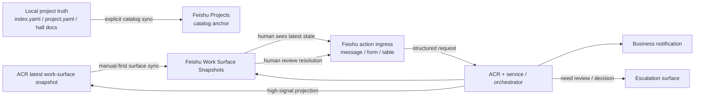

# Feishu Sync Architecture Note

## Purpose
把当前关于 Feishu 的讨论，从 `Cut 8A` 的单点 `work-surface adapter` 扩展为一份更完整的 **Feishu operating surface** 设计宿主。

本文档回答：
- Feishu 在 ACR 里到底承接哪些对象与工作面
- 各类对象的 truth host 分别在哪里
- 哪些同步能力是必须的，哪些应该后置
- 什么才是 `Feishu + OpenClaw + Codex` 真正可工作的最小闭环

本文档不授权：
- 自动新增任意表结构
- 自动开启 observer-based auto-apply
- 让 Feishu 反向决定 ACR / workflow truth

若后续需要新增/调整表、字段、枚举、view，仍需先与 Human 讨论确认。

## Why this note exists now
`Cut 8A` 已经证明：
- `Work Surface Snapshots` 这条 latest snapshot projection 路径可行
- `/project --surface-sync [--apply]` 已能在真实 Base 上完成 live sync
- `demo-acr` 已可用真实 high-signal snapshot 驱动一次 Feishu apply

但这也同时暴露出更大的设计题：
- 本地新建 project 如何进入 Feishu `Projects`
- Feishu 里的人类动作如何进入 ACR
- business notification / escalation 是否需要独立 Feishu surface
- `Tasks / Bugs` 何时才应该承接 projection，而不是过早变成第二真相层

因此当前不应把 Feishu 理解为“一个 sync 命令”，而应理解为：

> ACR 的一组 object-specific work operating surfaces。

## Current adopted principles
- 本地 `index.yaml + project.yaml + hall docs` 仍是 project truth
- orchestrator / service runtime 仍是 workflow truth
- Feishu 只能承接 projection / interaction / visibility，不得反向定义 truth
- 不同 Feishu object family 必须分开设计，不能揉成一个“通用 sync”
- `workflow surface` 与 `transport binding` 必须分离
- 每条写入链路都必须有显式 owner、stable key、failure policy
- 默认先走 manual / dry-run / apply，不先做 silent auto-sync
- schema drift / missing relation / enum mismatch / duplicate row 都应 clear fail 或进入显式 reconcile，不应 silent degrade

这里的新增原则具体指：
- 稳定概念应该是：
  - `automation_ingress`
  - `agent_coordination`
  - `governance_escalation`
- 当前已验证的 concrete binding 可以是：
  - Feishu `automation-ingress`
  - Feishu `agent-coordination`
  - `WeChat DM`
- 但这些 binding 不应被误解为 ACR 长期唯一入口
- `automation_ingress` 当前应被理解为 multi-source surface：
  - Feishu automation
  - Discord automation
  - Telegram automation
  都可以同时接入
- `agent_coordination` 当前更适合先有一个单一主工作面
  - 供 agent 间 review / handoff / 内部协作流转
  - 需要 Human 关注时再升级到 `WeChat DM`
- 若未来某个外部 automation 只支持 Discord：
  - 应复用同一逻辑 workflow surface
  - 只替换 concrete transport / target binding

补充说明：
- 当前代码与部分 contract 里仍存在 `dispatch / review` 这些词
- 现阶段应把它们理解为 first-slice 的实现期字面量
- 长期语义更稳定的命名应是：
  - `dispatch` -> `automation_ingress`
  - `review` 群工作面 -> `agent_coordination`
  - `WeChat DM` -> `governance_escalation`

## Object map
当前建议把 Feishu 侧对象拆成下面 6 类。

| surface | Feishu object | purpose | truth host | write owner | stage |
| --- | --- | --- | --- | --- | --- |
| Project Catalog | `Projects` | project anchor、relation target、human-facing project directory | 本地 project registry / docs | ACR sync 负责 canonical 字段；Human 可维护非真相增强字段 | next |
| Work Surface | `Work Surface Snapshots` | one-row-per-project latest high-signal summary | ACR latest work-surface snapshot | ACR adapter | current |
| Action Ingress | `TBD`（消息 / 表 / 表单 / card action） | 将 workflow-scoped action 送入 structured automation envelope | ACR normalized envelope ingress | ingress adapter | next |
| Business Notification | `TBD`（消息 / notification 表） | 承接 workflow-scoped business-side 高信号通知 | ACR signal promotion output | ACR adapter | next |
| Escalation Surface | `TBD`（消息 / escalation 表） | 承接需要 Human review / decision 的 governance 事项 | ACR main-session escalation object | ACR adapter + Human ack/resolve | next |
| Backlog Projection | `Tasks / Bugs` | 可选 backlog / work-item projection | orchestrator kernel / work-item truth | orchestrator-side adapter | defer |

补充说明：
- 这里虽然标题仍然是 “Feishu” sync architecture
- 但 `Action Ingress / Business Notification / Escalation Surface` 三类 object，长期都应按逻辑 surface 建模
- Feishu 只是当前 first slice 的默认 transport
- future 也可以出现 Discord / 其他 chat transport 的 sibling binding

## Surface taxonomy
当前进一步采用下面这组更稳定的逻辑 surface 命名：

- `automation_ingress`
  - 外部对 ACR 的 automation 请求入口
  - 可能来自：
    - Human 手动触发
    - Feishu Base 自动化
    - Telegram / Discord / 其他 bot 事件
  - 当前默认 binding：
    - `automation-ingress`

- `agent_coordination`
  - ACR 管理 agent 内部消息流转的工作面
  - 典型内容：
    - review
    - handoff
    - blocked 协作处理
  - 当前默认 binding：
    - `agent-coordination`

- `governance_escalation`
  - 需要 project owner 进入主会话处理的事项
  - 当前默认 binding：
    - `WeChat DM`

这组命名的关键价值在于：
- 不把逻辑语义绑死在 `dispatch/review` 两个词上
- 不把逻辑语义绑死在飞书群名上
- 更容易容纳 future 多 transport

## Current runtime binding hosts
当前与 transport / surface 相关的 runtime hosts 已分成三类：

- `feishu-adapter.yaml`
  - adapter-scoped binding
  - 例如 `work_surface`、`governance.default_target`
- `runtime-bindings.yaml`
  - canonical main-session binding
  - 例如 `wechat:dm:human -> agent:main:main`
- `workflow-bindings.yaml`
  - workflow-scoped default target binding
  - 当前已用于：
    - `dispatch.default_reply_target`
    - `review.default_reply_target`

这意味着：
- `workflow surface` 的默认 target 已经不必继续散落在代码或消息样板里
- 未来若换成 Discord / Telegram，只需替换 binding host，不应改 ACR core
- 后续若继续演进，建议把这里的 key 也逐步从实现期 `dispatch/review` 迁移成：
  - `automation_ingress`
  - `agent_coordination`

## Authority boundary
当前已采纳的 authority boundary 如下：

### 1. Project truth
宿主：
- `index.yaml`
- `project.yaml`
- `README.md`
- `STATUS.md`
- `RESUME.md`
- `execution/COLLAB.md`

Feishu 不得成为 project identity、objective、phase、continuity 的 authoritative host。

### 2. Workflow truth
宿主：
- orchestrator / service runtime
- task / run / queue / workflow state

Feishu 不得直接承接 workflow state transition truth。

### 3. Feishu operating surfaces
宿主语义：
- projection
- interaction
- visibility

Feishu 上的任何记录、卡片、消息，只有在经过显式 ingress contract 进入 ACR 后，才有机会改变 workflow truth。

## Ownership model
每类 surface 都应明确区分：
- `ACR-owned fields`
- `Human-owned fields`
- `structure-owned assets`

当前默认规则：
- 表结构、字段、枚举、view 由 Human review 后变更
- ACR runtime 只负责 record-level write，不偷改 schema
- ACR-owned fields 由 adapter 单向写入
- Human-owned fields 默认不应在 runtime apply 时被覆盖

这条规则当前已经在 `Work Surface Snapshots` 第一刀里被验证：
- `Project ID` 是稳定 lookup key
- `所属项目` 是 relation anchor
- `状态 / 标题 / 摘要 / 更新时间` 由 ACR adapter 写入

后续 `Projects`、`notification`、`escalation` 若进入实现，也必须先明确：
- 哪些字段可被 ACR 覆写
- 哪些字段是 Human 自由维护
- reconcile 时冲突如何处理

## Configuration host rule
当前已采纳一个跨 surface 的实现约束：

> **配置类信息可以先保持最小，但不应被做成“一次性项目”的 runtime hardcode。**

这里的“配置类信息”包括但不限于：
- base / table / field binding
- delivery target / channel target
- identity / runner / cli path
- relation write mode
- surface-specific mode default

### What should not be hardcoded
如果某个值满足下面任一条件，就不应长期 hardcode 在代码里：
- 会因运行环境不同而变化
- 会因 Base / chat / tenant 不同而变化
- 会因 Human 运营决策而变化
- 后续可能需要 project-owned override
- 属于 secret / token / target id / binding id

典型例子：
- Feishu Base token
- WeChat / Feishu governance target
- surface 对应的 target chat / thread / DM
- 不同 Base 的表名 / 字段映射绑定

### What may stay as code-level defaults for now
下面这类值当前可以继续留在代码常量层，但要明确它们是 contract defaults，而不是 deployment secrets：
- 当前 contract 的稳定逻辑字段名
- parser grammar 与 help text
- adapter 内部的默认 relation serialization mode
- 测试专用 fixture literal

换句话说：
- **跨环境、跨项目、跨 channel 会变化的值** 应该进显式 config host
- **全局 contract 语义默认值** 才适合暂时放在代码里

### Current implementation debt to track
当前已暴露、后续应逐步提升为显式配置宿主的点包括：
- `FEISHU_BASE_TOKEN` 之外的默认 Base token fallback
- work-surface adapter 对 live table / field binding 的默认值
- escalation / notification 的 default delivery target binding

当前不要求立刻把这些都实现成完整配置系统，但后续新功能不应继续沿着 hardcode 扩散。

这条配置宿主边界的第一份细化 contract 见：
- [feishu-adapter-config-host-contract.md](<repo-root>/plan/active/feishu-adapter-config-host-contract.md:1)

## Required feature set
如果目标是尽快让 `Feishu + OpenClaw + Codex` 能真正用于 ACR 工作，至少需要下面这些机制。

### 1. Catalog anchoring
本地 project 需要有一条进入 `Projects` 的显式路径，用于：
- relation target
- human-facing directory
- 后续 snapshot / task / escalation 的统一锚点

当前采纳的方向：
- `Projects` 是 catalog projection，不是 truth host
- `surface-sync` 不应 silent auto-create `Projects` row
- 缺 `Projects` relation target 时，应 preflight fail 并引导先做 catalog sync
- 该 surface 的第一份细化 contract 见：[feishu-project-catalog-sync-contract.md](<repo-root>/plan/active/feishu-project-catalog-sync-contract.md:1)

### 2. Idempotent projection writes
每个 projection surface 都应有稳定键与幂等写规则。

当前已验证：
- `Work Surface Snapshots` 使用 `Project ID` 作为稳定 lookup key
- one row per project
- `dry_run -> apply -> update` 路径可行

后续其他 surface 也需要各自 stable key，例如：
- `Projects`：`Project ID`
- `Action Ingress`：`request_id` 或 `trace_id`
- `Business Notification`：`notification_id`
- `Escalation Surface`：`escalation_id`

### 3. Structured ingress
Feishu 上的人类动作，不能直接改动 truth；必须先转成 ACR 可消费的结构化请求。

最小 ingress object 需要稳定携带：
- `project_id`
- `action_name`
- `workflow`
- `request_id`
- `trace_id`
- `requested_by`
- `payload / parameters`

这意味着后续必须决定：
- 第一种 ingress surface 选消息、表单、还是 Base 表
- 谁负责把它转换成 `NormalizedEnvelope`
- safe-fail 如何回显给 Feishu 人类操作者

当前推荐方向已进一步收敛为：
- 第一种 ingress 选 `Feishu IM message transport`
- `card action` 作为后续 ergonomic upgrade
- `Base table / form` 不作为第一刀 workflow ingress
- 细化 contract 见：[feishu-action-ingress-contract.md](<repo-root>/plan/active/feishu-action-ingress-contract.md:1)

### 4. Notification and escalation split
当前 ACR 内部已经把：
- `business notification`
- `main-session escalation`

明确分流。

Feishu 侧也应保留这个分流，而不是把所有高信号都塞进同一个表或同一个消息流。

原因：
- business-side 高信号并不都需要主会话打断
- review / decision 类事项的 ack / resolve 语义不同于普通通知
- escalation object 需要更强的人类治理约束

当前推荐方向已进一步收敛为：
- `Business Notification` 第一刀选 `Feishu IM message delivery`
- 默认优先回原 business/work chat 或 thread
- 不先做 notification table / feed board
- 细化 contract 见：[feishu-business-notification-surface-contract.md](<repo-root>/plan/active/feishu-business-notification-surface-contract.md:1)

当前对 `Escalation Surface` 的推荐方向也已进一步收敛为：
- 第一刀选 `Feishu IM governance alert mirror`
- 只做 secondary visibility mirror，不做 primary control plane
- 不默认回原 business/work chat
- 默认走全局 `governance target`，未来允许 project-owned override
- 当前全局 default target 已定为 `WeChat DM`
- 但这属于显式配置 binding，不得 hardcode 在 runtime / adapter 代码里
- schema 可预留多 channel，但 first slice 不默认 fan-out
- 当前 runtime 已先落一条更保守的 delivery path：
  - `main-session escalation` 会消费 `governance.default_target`
  - 先进入幂等的 `governance delivery outbox`
  - 再通过 OpenClaw runtime sender 投递到解析后的 canonical session
  - 当前仍未直接接 WeChat / Feishu 外部 API
- 细化 contract 见：[feishu-escalation-surface-contract.md](<repo-root>/plan/active/feishu-escalation-surface-contract.md:1)

当前已进一步采纳一组更具体的 Feishu / WeChat operating-surface 分工：
- `automation_ingress`
  - 当前默认 binding：`automation-ingress`
  - 承接外部 automation 到 ACR 的 structured input
  - 以及与这类外部请求同上下文的 result reply / business notification
- `agent_coordination`
  - 当前默认 binding：`agent-coordination`
  - 承接 agent 间协作、review 过程与内部流转
- `governance_escalation`
  - 当前默认 binding：`WeChat DM`
  - 只承接 `main-session escalation`

因此当前的默认路由理念是：
- `automation_ingress` traffic 不应污染 `agent_coordination`
- `agent_coordination` traffic 不应默认升级进 `WeChat DM`
- `WeChat DM` 是 governance overlay，不是 workflow chat 的替代品

### 5. Reconcile, drift detection, and cleanup
只做 `apply` 不够，长期可用还需要：
- live schema inspect
- truth vs Feishu diff
- duplicate row detection
- orphan relation detection
- enum drift detection
- stale projection cleanup / archive policy

这类能力不一定一开始就全部实现，但架构上必须预留。

### 6. Sync audit trail
每次 sync 至少应能回答：
- 是哪种 surface
- 由谁触发
- 用的是什么 mode
- stable key 是什么
- create/update/fail 的结果是什么
- trace_id / request_id 是什么

否则后续一旦出现 drift、重复记录、误写、漏写，很难治理。

### 7. Permission and identity boundary
不同 Feishu 能力可能走不同身份：
- bot
- user
- future service account

因此要明确：
- 哪些 surface 允许 bot-only
- 哪些操作需要 human review
- 哪些结构调整绝不应由 runtime 执行

## Sync modes
当前建议把所有 Feishu surface 的操作统一约束在下面这些 mode 语义下。

| mode | purpose | default use |
| --- | --- | --- |
| `inspect` | 只读检查 live schema / field / record shape | 调试、preflight、drift check |
| `dry_run` | 生成 plan，不写入 Feishu | 默认操作模式 |
| `apply` | 对单个 surface / 单个对象执行真实写入 | 人工确认后的最小 apply |
| `reconcile` | 对 truth 与 Feishu 当前状态做 diff，并给出修复建议或显式 apply | drift / duplicate / mismatch 治理 |
| `backfill` | 批量补齐 catalog / projection 历史对象 | 初始化或大规模修复 |
| `observe` | 事件驱动的自动 apply | 仅对少数已批准 surface 考虑开启 |

当前已经采纳的默认值：
- `Work Surface Snapshots`：manual-first，默认 `dry_run`
- `observer hook`：存在，但不默认自动 apply
- `schema mutation`：不属于 runtime `apply`

## Failure policy
当前建议的 failure policy 如下。

### Preflight hard-fail
遇到下面情况时，应直接 fail，不做降级写入：
- 缺目标表
- 缺目标字段
- relation target 不存在
- enum option 缺失
- stable key 无法唯一定位

### Reconcile-required
遇到下面情况时，应显式进入 reconcile，而不是继续 apply：
- stable key 出现多条记录
- 人工修改导致 ACR-owned fields 与 truth 冲突
- schema 与 contract 发生轻微漂移但尚可识别

### Safe-fail with feedback
遇到下面情况时，应面向操作者 clear fail：
- Feishu action ingress 解析失败
- 人类缺少必要参数
- 权限不足
- target object 尚未 catalog anchor

## Minimum operating loop
如果目标是尽快让 `Feishu + OpenClaw + Codex` 真正服务 ACR 的日常推进，我建议先打通这一条最小闭环：

1. 本地 project 被显式 catalog 到 `Projects`
2. ACR 产出 latest work-surface snapshot
3. `/project --surface-sync [--apply]` 将 snapshot 推到 `Work Surface Snapshots`
4. Human 在 Feishu 中看到项目当前 high-signal 状态
5. Human 从 Feishu 发起一个结构化 action request
6. OpenClaw / Codex 通过 ACR + service path 执行
7. 执行结果回到：
   - latest snapshot
   - business notification
   - 若需要，再进入 escalation surface

在当前进一步澄清后的真实闭环里，还应补上一个 Human review resolution 回流：

8. Human 若在 `Tasks / Bugs` card 上对 `Reviewing` 阶段做出验收 / 驳回
9. Feishu 自动化应把该动作重新送入 `automation_ingress`
10. ACR 再决定最终收口 / reopen / 通知 / 分流到 `agent_coordination` 或升级到 `governance_escalation`

## Recommended phasing
当前建议不再把后续工作理解为“平铺把 6 个 surface 一起做出来”，而是按一个更贴近真实使用的 rollout 顺序推进。

### 已 live-validated 的前置能力
这几项已不再只是 design decision，而是已经过真实运行验证：
- `Work Surface Snapshots` latest snapshot projection
- `/project --surface-sync [--apply]`
- `main-session escalation -> governance outbox -> WeChat DM`
- `/project --governance` inspect

这意味着当前已经有一条可工作的 **governance loop**：
- ACR 能把 `blocked` / 需要 project owner 处理的事项送到主会话
- Human 不必等 Feishu inbound 才能继续使用系统

因此后续优先级应围绕“尽快把 Feishu 变成 daily operating surface”来排，而不是先追求双向完备。

### P0 — Feishu operating surface first usable slice
先做最影响日常使用、同时最不容易扭曲 truth boundary 的三项：
- `Projects` catalog sync first slice
- `Work Surface Snapshots` 稳定化与真实项目覆盖
- `Business Notification` 的 Feishu IM delivery

理由：
- `Projects` 是后续 relation / notification / surface 的统一锚点
- `Work Surface Snapshots` 已可用，但还受缺 catalog anchor 约束
- `Business Notification` 一旦进入 Feishu work chat，Feishu 才真正开始承担日常工作面的“协作可见度”

当前状态更新：
- `Projects` catalog sync first slice 已 implemented + auto-validated + live-validated
- `Business Notification` 的 Feishu IM delivery first slice 已 implemented + auto-validated
  - 当前已新增：
    - `BusinessNotificationDeliveryRecord` outbox
    - `/project [<project_ref>] --notifications`
    - 默认 `record-only` fallback
    - 基于 `lark-cli im` 的 bot sender
  - 当前仍未做真实 Feishu business/work chat 的 live validation
- `demo-acr` 已在真实 Base 上验证 `noop` 语义：
  - dry-run 显示 `noop`
  - apply 仍保持 `noop`
  - 不会重复创建第二条 `Projects` row
- 因此 P0 的下一个实现重点已前移为：
  - `Business Notification` 的真实 Feishu IM live validation
  - `proj-assistant-context-router` self-hosted real usage

### P1 — Self-hosted real usage and inward loop
在 `P0` 之后，优先让系统开始承接自身项目的真实迭代，而不是立刻追求更花哨的 Feishu 控件：
- 为 `proj-assistant-context-router` 补最小 self-hosted harness
- 用真实 ACR 项目推进继续覆盖 demo-only traffic
- 再实现第一种 `Feishu -> ACR` action ingress

理由：
- ACR 应该是 ACR 的第一个客户项目
- 只有当 `catalog + surface + notification` 都先稳定后，Feishu inbound 才不会变成“能发请求，但看不到稳定 operating state”的半闭环

### P2 — Ergonomics and governance hardening
- `card action` ergonomic upgrade
- reconcile / drift detection
- duplicate cleanup policy
- sync audit trail
- permission / identity discipline

### P3 — Backlog projection
- `Tasks / Bugs` 何时承接 projection
- 与 orchestrator truth 的边界
- 状态机映射
- Human override 规则
- `Task/Bug` 字段 ownership、`acceptance_mode`、`completion_notify_mode`

这条边界的第一份细化 contract 见：
- [feishu-task-bug-ownership-acceptance-contract.md](<repo-root>/plan/active/feishu-task-bug-ownership-acceptance-contract.md:1)

## Immediate design follow-ups
当前建议的实现顺序如下：

1. `Projects` catalog sync first slice 已完成实现  
   当前已具备 `/project [<project_ref>] --catalog-sync [--apply]`，并已支持 `create / update / noop`。
2. `Business Notification` 的 Feishu IM delivery first slice 已完成实现  
   当前已具备 delivery outbox、`record_only` fallback、`lark-cli im` sender 与 `/project --notifications` inspect，但还需要一轮真实 Feishu live validation。
3. 先 formalize `Tasks / Bugs` 的 writeback ownership 与 acceptance policy  
   原因：在真实 `dispatch group -> Task/Bug card writeback` 闭环里，若不先钉住 `状态`、`acceptance_mode`、`completion_notify_mode` 的边界，后续 live flow 很容易把 Feishu card 错写成 truth host。
4. 然后让 `proj-assistant-context-router` 成为 self-hosted customer  
   原因：后续 Feishu flow 应优先吃真实 ACR 自身迭代 traffic，而不是长期停留在 `demo-acr`。
5. 再实现第一种 `Feishu Action Ingress`  
   原因：到这一步时，Feishu 上已经同时有 project anchor、latest state、work-side notification、以及 card writeback ownership 边界；Human 从 Feishu 发起 action 才算进入完整 operating loop。
6. 最后再进入 `card action / reconcile / backlog projection`

## Relationship to Cut 8A
`Cut 8A` 已完成的是：
- `Work Surface Snapshots` 第一刀 schema
- `lark-cli base` adapter
- `/project --surface-sync [--apply]`
- live dry-run / create / update

本文档处理的是 `Cut 8A` 之后的更大问题：
- 如何把 Feishu 从“单一 latest snapshot projection”扩展成真正可工作的 operating surface
- 同时又不破坏 ACR 当前的 truth boundary 与 governance 纪律
