# Semantic Execution Bridge Contract

## Purpose
定义 Step 2 下一刀从 `validation_fixture` 升级到真实语义执行桥的最小 contract。

本文档回答：
- 当前已经打通的到底是哪半条闭环
- 为什么 `dispatch -> Doing/Fixing` 还不等于真正语义执行
- `Task / Bug` row 的业务字段应如何被读取为执行上下文
- `complete / review_request / blocked` 应由谁产出
- 第一版真实执行桥应落在哪个边界上

本文档承接：
- [project-owned-service-bridge-contract.md](<repo-root>/plan/active/project-owned-service-bridge-contract.md:1)
- [feishu-work-surface-operating-model.md](<repo-root>/plan/active/feishu-work-surface-operating-model.md:1)
- [feishu-task-bug-ownership-acceptance-contract.md](<repo-root>/plan/active/feishu-task-bug-ownership-acceptance-contract.md:1)
- [feishu-action-ingress-contract.md](<repo-root>/plan/active/feishu-action-ingress-contract.md:1)

## Current live conclusion
当前 runtime / auto-test 已经打通的是：

`Todo -> Doing/Fixing`
-> `dispatch`
-> ACR route / service path
-> `feishu_task_bug_semantic`
-> read `Task/Bug` row
-> queue trusted main-session execution request
-> record pending semantic execution on the target main session
-> main-session agent emits an explicit boundary block in assistant output
-> ACR `llm_output` captures that boundary
-> `Task/Bug writeback`
-> `complete / review_resolution`
-> `Reviewing / Done / Fixed / Todo`

这条链当前证明：
- Feishu work surface 可以稳定触发 `automation_ingress`
- ACR 可以稳定回写 ACR-owned 字段
- `acceptance_mode`
  - 可以控制 `complete` 是进入 `Reviewing`
  - 还是直接进入 `Done / Fixed`
- Human 在 `Reviewing -> Done / Fixed / Todo` 上的验收动作，也可以稳定回流 ACR
- `proj-assistant-context-router/router.yaml` 已从 `validation_fixture` 切到：
  - `service_binding.runtime_kind = feishu_task_bug_semantic`
  - `target_ref = agent:main:main`
- Feishu Base / bot identity / `Tasks` / `Bugs` 字段读取已通过 live preflight
- main session 不再需要 project owner 手工复制粘贴 `complete`
  - `dispatch` 会在目标 main session 写入 `pending_semantic_execution`
  - `dispatch` 只请求唤醒目标 main session；当 runtime 提供异步 heartbeat API 时，不等待 main-session heartbeat/model 执行完成
  - agent 正常执行后，只需在 assistant output 中产出严格 `[ACR_AUTOMATION]...[/ACR_AUTOMATION]` boundary block
  - OpenClaw `llm_output` hook 会在 pending execution 存在时自动捕获并重新进入 ACR service / writeback 链

当前 live 侧已经验证到 `dispatch -> main session semantic execution request`，仍需 live 验收的是重启后的端到端自动边界：

> 从 Feishu `Todo -> Doing/Fixing` 触发 dispatch，main session agent 完成真实工作后在 assistant output 中产出 boundary block，ACR 自动捕获并把 card 推进到 `Reviewing` 或 `Done / Fixed`。

## What is no longer placeholder
当前 `proj-assistant-context-router` 的 project-owned `router.yaml` 已经不再是：

- `service_binding.runtime_kind = validation_fixture`

`dispatch` 不再只按 action name 命中 fixture，而是会读取：
- `Task.任务 / DoD / 描述`
- 或 `Bug.描述 / 复现方式 / 预期结果 / 实际结果`

并将这些字段组装为 main-session execution context。

当前仍保持克制的是：
- main-session mediated executor 只负责投递真实执行请求
- 它不会在 `dispatch` 时自动宣布完成
- 真实完成仍必须由 agent 后续显式产出 `complete`
- 但这个 `complete` 不再要求 Human 手工复制到聊天里；它由 `llm_output` 在同一 main session 内自动捕获
- `validation/service-results.json` 仍保留为旧 rehearsal fixture，但不再是当前 ACR self-host live router 的 active service binding

## Core decision
下一刀不再优先补外围 workflow / 更多表字段 / 更多回执样式。

当前采纳：

> Step 2 的下一工作切口应是  
> `semantic execution bridge first slice`。

它的目标是：
- 保持现有 `automation_ingress -> writeback -> acceptance` 主链不变
- 只把 `service_binding` 从 `validation_fixture` 升级成
  - 会读 row
  - 会组装执行上下文
  - 会驱动真实执行
  - 会显式产出后续 action/result
  的 project-owned bridge

## Ownership split

### ACR core owns
- `dispatch / complete / review_resolution` 的通用 route semantics
- `NormalizedEnvelope`
- `ServiceResult` shell
- `Task/Bug writeback`
- `acceptance_mode / completion_notify_mode / start_mode` 的 contract

### Project-owned semantic bridge owns
- 如何从 `task_record_id / bug_record_id` 读取 row
- 读取哪些业务字段进入 execution context
- 如何把 row context 翻译成真实 executor input
- executor 完成后如何显式产出：
  - `complete`
  - `review_request`
  - `blocked`
  - `service_error`

### Feishu work surface owns
- `Todo / Doing / Fixing / Reviewing / Done / Fixed` 这些工作面状态
- Human 对 `Reviewing -> Done / Fixed / Todo` 的验收动作
- Human-owned backlog / bug definition fields

## Read vs own boundary
下一刀必须继续遵守：

> ACR / semantic bridge 可以读取 Human-owned 字段做执行上下文，  
> 但不因此取得这些字段的 ownership。

### Task rows
第一版允许读取：
- `任务`
- `DoD`
- `优先级`
- `截止时间`
- `任务执行人`
- `所属项目`

### Bug rows
第一版允许读取：
- `描述`
- `复现方式`
- `预期结果`
- `实际结果`
- `优先级`
- `Assignee`
- `验证人`
- `所属项目`

当前不应依赖：
- `resource_key`
- `AI 任务风险判断`
- 任何尚未稳定定义的临时字段

## Action sequence
第一版真实执行桥的目标 sequence 应是：

1. Human 在 Base 上把 row 从 `Todo -> Doing / Fixing`
2. Feishu workflow 发 `dispatch`
3. ACR route 到 project-owned semantic bridge
4. bridge 根据 `task_record_id / bug_record_id` 读取 row
5. bridge 组装 execution context
6. bridge 调用真实 executor，并在目标 main session 写入 `pending_semantic_execution`
7. main-session agent 基于 execution context 做真实工作
8. agent 到达边界时，在 assistant output 中显式产出后续高层结果：
   - `complete`
   - `review_request`
   - `blocked`
9. OpenClaw `llm_output` hook 在 pending execution 存在时捕获严格 wrapper
10. ACR 复用现有 writeback / notification / escalation 链继续推进

关键约束：

- `dispatch accepted`
  - 只代表执行已开始
  - 不等于执行已完成
- `complete`
  - 必须显式出现
  - 不能由 `dispatch` 自动隐式推断
  - 第一版必须使用严格 `[ACR_AUTOMATION]...[/ACR_AUTOMATION]` wrapper
  - 只在当前 session 存在 matching `pending_semantic_execution` 时被 ACR 捕获
  - 必须显式携带 concrete `parameters.summary`
    - 不能缺省
    - 不能使用 placeholder
    - 不能由 ACR fallback 到 task title / bug title
  - 应携带 `parameters.evidence`，说明 changed records / files / commands / verification evidence
    - 对文件、命令、调研类任务，`evidence` 可以是文字化验证说明
    - 对外部 work-surface record mutation，`evidence` 不能只是 prose claim
    - `summary` 是短收口，适合写入 `next_action` / notification headline
    - `evidence` 是执行细节，必须随 `summary` 一起进入 card-facing execution report
      - Task: 写入 `执行摘要`
      - Bug: 写入 `修复方式`
  - 若 `complete` 声称修改了外部 work-surface records，必须携带 `parameters.work_surface_operations`
    - ACR / adapter 根据这些结构化操作执行并验证 side effect
    - 缺少结构化操作时，即使 summary 写了“已更新记录”，也不能被接受为完成
    - verification 失败时应转为 `blocked / needs_escalation`，不能推进 source card 到 completion boundary
  - Feishu Base record mutation 的第一版 operation shape：
    - `operation = update_record`
    - `source_system = feishu_base`
    - `table_id`
    - `record_id`
    - `set_fields`
    - `verify_fields`
  - Bug `complete` 必须在 parameters 中携带 `fix_result`
    - 合法值：`Fixed / Won't fix / Can't rep`
    - `Need review` 不属于 Bug `修复结果`，只属于 ACR `step_result = need_review`
- `service_error`
  - 仍属于 service / executor failure result
  - 不作为第一版 main-session assistant-output boundary 捕获目标

```mermaid
flowchart LR
  A["Feishu card: Todo -> Doing/Fixing"] --> B["Feishu workflow dispatch"]
  B --> C["ACR semantic bridge reads Task/Bug row"]
  C --> D["Main session trusted system event"]
  D --> E["Agent performs real work"]
  E --> F["Assistant output: boundary ACR_AUTOMATION block"]
  F --> G["ACR llm_output captures pending semantic boundary"]
  G --> H["Service/writeback pipeline"]
  H --> I["Reviewing or Done/Fixed by acceptance_mode"]
  I --> J["Human Reviewing -> Done/Fixed/Todo"]
  J --> K["review_resolution finalizes COMPLETE/accepted or REPLAN/rejected"]
```

## First-slice output contract
第一版真实语义执行桥至少要能稳定产出以下几类结果：

### 1. accepted / queued
用于：
- row 进入 `Doing / Fixing` 后，执行正式开始

### 2. blocked
用于：
- 缺少前置条件
- 需要 Human 决策
- 外部依赖失败但不应直接伪装为完成

### 3. review_request
用于：
- 执行产物已到达 review boundary
- 但还不能直接完结

### 4. complete
用于：
- executor 明确宣布“已到达完成边界”
- 再由 `acceptance_mode` 决定：
  - 进入 `Reviewing`
  - 或直接 `Done / Fixed`

补充 side-effect rule：
- 如果完成的真实结果包含外部 record/card 更新，agent 不应只输出“已更新”的自然语言 evidence
- agent 应输出结构化 `work_surface_operations`
- bridge 在接受 `complete` 前负责执行并读回验证这些 operations
- 这让“识别目标 row”和“实际移动/写入目标 row”成为两个可审计边界，而不是混在一句 summary 里

## Relationship to `acceptance_mode`
当前保持不变：

- `dispatch`
  - 只推进到 `Doing / Fixing`
- `complete`
  - 才交给 `acceptance_mode` 决定终态分叉

也就是说：
- `manual_acceptance`
  - `complete -> Reviewing / REVIEW_WAIT / need_review`
- `agent_can_finalize`
  - `complete -> Done / Fixed / COMPLETE / accepted`

因此下一刀不是重写 `acceptance_mode`，而是：

> 让真实 executor 能产出真正的 `complete`，并让 ACR 在 main session 输出边界自动捕获它。

## Definition of done for this cut
这一刀算完成，不是因为模型“看起来会做事了”，而是因为：

1. `dispatch` 不再只按 `action_name` 命中 fixture
2. semantic bridge 能真实读取 row 内容
3. row 内容会进入 executor input
4. executor 能显式产出 `complete / review_request / blocked`
5. 现有 writeback / review_resolution / escalation 链无需重写即可承接

## Implementation status
当前 first implementation slice 已落地并通过自动测试。

已实现：
- core `ServiceResult` 新增 `work_surface_action`
  - 用于让 executor 显式声明本次结果应按哪个 work-surface boundary 承接
  - 当前支持：`dispatch / review / review_request / review_resolution / complete / blocked`
- Feishu semantic bridge 新增 runtime kind：
  - `feishu_task_bug_semantic`
- bridge first slice 已支持：
  - 从 `task_record_id / bug_record_id` 解析 row anchor
  - 读取 `Tasks / Bugs` row
  - 组装最小 execution context
  - 将 context 传给 project-owned executor
- `Task/Bug writeback` 已能消费 `serviceResult.work_surface_action`
  - 因此一个 `dispatch` service call 的 executor 若显式返回 `work_surface_action: complete`
  - writeback 会进入现有 `complete -> acceptance_mode` 边界
  - 这不是隐式推断 completion，而是 executor 显式宣布 completion boundary
- OpenClaw plugin 已注册 `feishu_task_bug_semantic` bridge adapter
- OpenClaw main-session mediated executor first slice 已接入
  - `dispatch`
    - 把 execution context 投递为 trusted system event
    - 请求唤醒目标 main session
      - 若 runtime 提供 `requestHeartbeatNow`，必须使用非阻塞请求，不能等待 `runHeartbeatOnce`
      - `runHeartbeatOnce` 只作为没有异步请求 API 时的 fallback
    - 在目标 main session 写入 `pending_semantic_execution`
    - 返回 `queued + work_surface_action: dispatch`
    - 因此 card 继续停在 `Doing / Fixing / EXECUTE / in_progress`
  - `complete`
    - 不再二次投递
    - 若缺少 concrete `summary`，会 fail closed 为 `blocked / needs_escalation`
    - 若声称外部 work-surface records 已被更新，但缺少结构化 `work_surface_operations`，会 fail closed
    - passthrough 为 `work_surface_action: complete`
    - 交给现有 `acceptance_mode` 分叉
  - `review / review_request / blocked`
    - passthrough 为 review/block boundary
    - 交给现有 writeback / escalation 链承接
- OpenClaw `llm_output` semantic boundary capture 已接入
  - 只在当前 session 存在 `pending_semantic_execution` 时工作
  - 只接受 strict wrapper：`[ACR_AUTOMATION]...[/ACR_AUTOMATION]`
  - 只接受 `source_type = agent`
  - 只接受 boundary action：
    - `complete`
    - `review`
    - `review_request`
    - `blocked`
  - 会把 pending 的 `task_record_id / bug_record_id / semantic_source_trace_id` 合并回 envelope
  - 捕获成功后复用现有 route / service / writeback / signal promotion 链
  - 捕获成功后清空 `pending_semantic_execution`

当前 live switch：
- [router.yaml](<repo-root>/router.yaml:1) 已切到 `feishu_task_bug_semantic`
- 当前 target 为 `agent:main:main`
- 本机 runtime binding preflight 已确认：
  - `agent:main:main` 是当前 canonical main session
- 本机 Feishu preflight 已确认：
  - `lark-cli base +table-list` 可通过 bot identity 读取 live Base
  - `Tasks / Bugs` 关键字段存在

仍然保持克制：
- 若没有 executor target，bridge 会 safe-fail/block，而不是把任务假装执行了
- `dispatch` 只 queue main-session execution request
- `complete` 必须由后续 agent 显式产出
- `complete` 不能只复制 schema 或只带 record id；缺少 concrete `summary` 时不会被接受为完成
- 外部 record mutation 不能只靠 prose evidence；Feishu bridge 会执行并验证 `work_surface_operations`

验证：
- targeted tests:
  - `harness-boundary-protocol.test.ts`
  - `feishu-task-bug-semantic-service-bridge.test.ts`
  - `feishu-task-bug-writeback.test.ts`
  - `semantic-execution-executor.test.ts`
  - `semantic-boundary-output.test.ts`
- full plugin test suite:
- `232/232` passed
- live preflight:
  - Feishu Base table list passed
  - `Tasks / Bugs` field list passed
  - runtime binding target checked
- live acceptance finding:
  - `dispatch -> semantic execution request` 已验证可到 main session
  - `source_type=agent` 的 boundary route 已修复
  - main session semantic boundary 不再要求 Human 手工复制；由 `llm_output` 在 pending execution 存在时自动捕获
  - regression 已补齐 Bug complete boundary：
    - pending `bug_record_id` 会被合并回 agent boundary envelope
    - `fix_result` 会保留到 service/writeback 链
    - `completion_notify_mode = dm_on_completion_boundary` 会生成配置化 human DM business notification
    - 不会创建 governance truth

## Non-goals
这一刀不负责：
- 把 Feishu Base 变成 truth host
- 一次性做完整 agent planner
- 提前引入多 executor / 多 runtime 抽象
- 提前把 `completion_notify_mode` 扩展为多目标、多渠道 delivery policy；当前只支持 completion boundary 的配置化 human DM
- 提前让 ACR 自动创建 backlog 后又自动自触发

## Current live validation status
当前 Bug path / completion-boundary notification 已完成 live acceptance：

1. Feishu `Bugs: Todo -> Fixing` 能触发 semantic dispatch
2. dispatch 群能收到 semantic queued 回执
3. main session 能收到 `Assistant Context Router semantic execution request`
4. bug card 会进入执行中：
   - `current_step = EXECUTE`
   - `step_result = in_progress`
5. agent-output strict `[ACR_AUTOMATION]` boundary block 会被 `llm_output` 自动捕获
6. Bug complete boundary 会保留：
   - `summary`
   - `evidence`
   - `fix_result`
7. card 会按 `acceptance_mode` 进入 `Reviewing` 或 `Fixed`
8. 若 `ACR完成提醒 = 完成边界提醒`，WeChat DM 可收到 completion-boundary business notification
9. WeChat direct channel failure 会 fallback 到 OpenClaw main-session delivery，并保留 `/project --notifications` delivery audit

这意味着当前主线不再需要 project owner 手工复制 `complete` block，也不再被 completion-boundary DM 阻塞。

## Cut 8F self-host live validation
2026-05-04 的 Cut 8F 用 ACR 自己的一条真实 `Task` 验证了 self-hosted semantic execution quality，不再使用 placeholder fixture。

第一条 live task：
- Task record: `<self-host-task-record-overflow>`
- Feishu `Todo -> Doing` dispatch 成功
- card 进入 `Doing / EXECUTE / in_progress`
- lane 记录到 `queued`
- main session 收到真实 semantic execution request
- 但没有到达 complete boundary

失败证据：
- `gateway.err.log` 在 `2026-05-04 23:40:31 +08:00` 记录 `context-overflow-diag`
- session: `agent:main:main`
- error: `Context overflow: estimated context size exceeds safe threshold during tool loop`
- 当次 semantic request 约 `24,394` chars

结论：
- 这次 failure 指向 main-session prompt / tool-loop budget，而不是 `lark-cli auth`、enum drift、notification fallback 旧分支。
- 因此修复边界必须放在通用 context / playbook / prompt budget / work-surface guidance 上，不能为某一张 card hardcode。

已落地的通用 first-slice 修复：
- harness context assembly 不再 inline 完整 playbook 正文
  - 只注入 selected playbook 的 id / scope / status / absolute path
  - 追加 `playbook_guidance_summary`
- pending semantic execution 的 `before_prompt_build` 注入改为 compact context
  - 保留：`execution_context`
  - 保留：`adapter_facts_json / work_surface_navigation_manifest`
  - 保留：selected playbook references
  - 保留：boundary schema
  - 保留：row anchors
  - 省略完整 `work_surface_origin_json` block，只保留 origin summary
- prompt guidance 新增通用预算规则：
  - 先做 targeted search / bounded reads
  - 避免 vague repo-root `rg`
  - 先识别 repo / package layout，再运行 package-manager script

第二条 live retry：
- Task record: `<self-host-task-record-complete>`
- title: `[ACR self-host] Cut 8F compact semantic execution retry`
- Feishu `Todo -> Doing` dispatch 成功
- lane 在 `2026-05-04T15:48:15.425Z` 记录 `queued`
- main session 收到 compact 后的 semantic request，约 `15,703` chars
- main-session agent 做了真实 repo 检查、代码修改、doc writeback，并在 assistant output 里产出 strict `[ACR_AUTOMATION] complete`
- lane 在 `2026-05-04T15:51:44.299Z` 记录 `proj-assistant-context-router:complete`
- service result: `accepted`
- side-effect contract: `applied_and_verified`
- live row readback 已确认：
  - `状态 = Reviewing`
  - `current_step = REVIEW_WAIT`
  - `step_result = need_review`
  - `next_action = 等待人工验收: ...`
  - `执行摘要` 包含 summary + evidence

质量 finding：
- retry 中 main session 曾做一次过宽 `rg`，单次 tool output 约 `39,879` chars。
- retry 中 main session 曾从 project root 跑 `npm test`，因该 root 没有 `package.json` 得到 `ENOENT`。
- 这两个都属于通用 semantic execution quality 问题，已通过 prompt guidance 收紧为 targeted search 与 repo/package layout inspection。
- 本线程随后在正确 package host [implementation/adapters/openclaw/plugin/package.json](<repo-root>/implementation/adapters/openclaw/plugin/package.json:1) 下运行 `npm test`，结果 `237/237` passed。

当前 Cut 8F 结论：
- Feishu card -> ACR dispatch -> main session semantic execution -> agent-output complete boundary -> card writeback 已在真实 ACR 自托管任务上跑通。
- 该闭环当前进入 `manual_acceptance` 设计下的 `Reviewing / REVIEW_WAIT / need_review`，不是直接 terminal done。
- optional completion-boundary notification 属于附加 delivery surface；本轮不把旧 WeChat delivery recovery 噪音作为 semantic execution pass/fail 条件。

## Immediate next step
下一步应回到产品 / workflow 主线：

1. 让 Human 对 `<self-host-task-record-complete>` 做 Reviewing acceptance 或 rejection，验证人工验收回流
2. 继续用 `proj-assistant-context-router` 自身作为第一用户跑下一条更复杂真实任务
3. 优先观察 context package 是否足够、tool-output budget 是否稳定、work_surface_operations 是否能承接真实外部 record mutation
4. notification delivery reconcile 只在新的 live evidence 重新指向它时再打开
