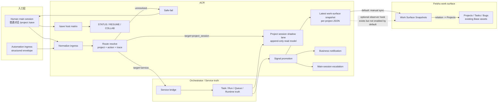
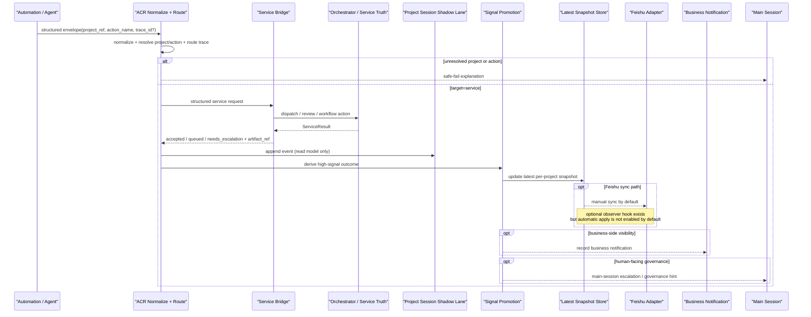
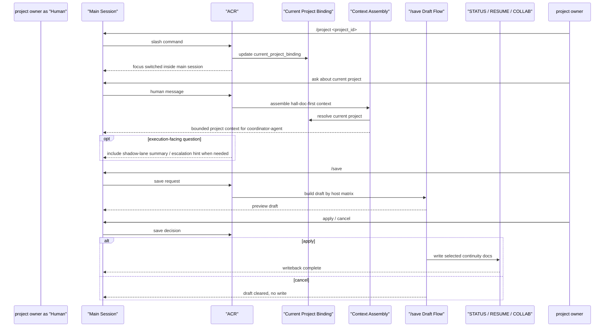
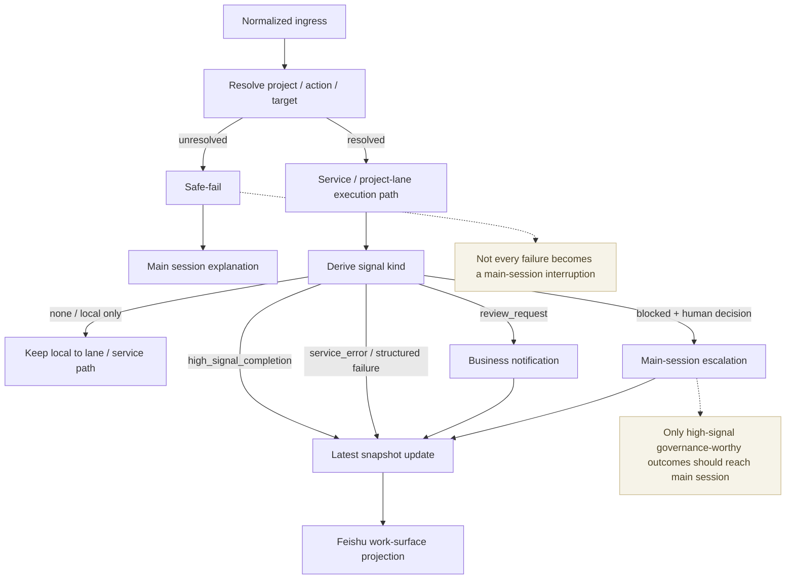
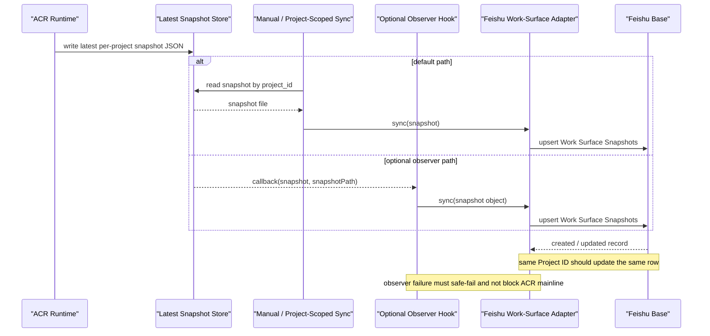

# System Architecture v1

## Purpose
为 `assistant-context-router` 定义一份顶层系统架构说明，明确这不是一个绑定 `OpenClaw + Codex` 的单点方案，而是一套：

- 以 project docs 为真相层
- 以 secretary runtime 为协作入口
- 以专业 agent 为执行面
- 以 memory / orchestration 为可插拔核心模块
- 以 human-in-the-loop 为治理原则

的长期演进架构。

## North Star

> 一个 personal-first 的 AI secretary collaboration system：秘书层维护长期上下文与协作控制，专业 agent 承担项目执行，项目文件作为跨 agent / 跨 runtime 的主真相，人类保留 review、决策与 takeover 权。

默认关系：
- project owner 主要与 coordinator agent 交互
- coordinator agent 负责摘要、编排、转述、收口
- 外部 agents 负责专业执行
- 人类不是消息总线，而是 review / decision / takeover owner

## Layer Model

### 1. Project Truth Layer
稳定真相层，默认包括：
- `README.md`
- `STATUS.md`
- `RESUME.md`
- `execution/COLLAB.md`

职责：
- 定义项目长期身份
- 表达当前阶段
- 提供可恢复工作态
- 承载多 agent 流转对象

约束：
- 这是跨 runtime、跨 session、跨 agent 的主真相
- 任何 adapter 都不能替代这一层

### 2. Project Switching & Recovery Layer
主要入口：
- `/projects`
- `/project`
- `/save`

职责：
- 显式切换项目边界
- 恢复当前项目 working state
- 将当前工作态收回到 project truth host

当前原则：
- hall-doc-first
- bounded by default
- `/project` 负责进入
- `/save` 负责 conversational 收口：先 draft、后确认、再 apply

### 3. Context Assembly Layer
职责：
- 构建默认 project context
- 定义 optional buckets
- 约束默认注入预算

默认方向：
- identity / status / resume first
- optional bucket 按需下钻
- 不把 full conversation 或 collab panel 作为默认注入

### 4. Memory Layer
memory 是一级核心模块，但不能替代真相层。

本层分三类：

#### Project Truth
- 项目文件对象
- 不属于 memory backend

#### Working Memory
- session/project/workflow/recent route trace/current working set

#### Long-Term Memory
- 用户偏好
- 长期关系
- 历史模式
- conversation-derived recall
- archive recall

约束：
- memory backend 只能增强 recall / continuity
- 不能替代 `STATUS.md` / `RESUME.md`
- 不能成为 `/project` 的 authoritative source

### 5. Routing Layer
职责：
- 处理 project / protocol / workflow 分层
- 产出 route trace
- unresolved 时 safe-fail

当前定位：
- Step 2 的主交付层
- 建立在 Step 1.5 recovery baseline 之上

### 6. Execution Mode / Backend Layer
这一层负责“怎么执行”，不是“什么是真相”。

可能后端：
- ACP
- native thread
- LangGraph
- OpenAI Agents SDK
- future workflow runtimes

约束：
- orchestration backend 不得 host project truth
- orchestration backend 不得单独定义 human governance
- collaboration policy layer 不等于 orchestration engine

### 7. Runtime Adapter Layer
当前 / 未来 secretary/runtime 适配层：
- OpenClaw runtime adapter
- Hermes runtime adapter
- future runtime adapters

职责：
- 消费 runtime 提供的 session identity / binding 结果
- 将 ACR 的 `main session` / `project session` 通用语义映射到 runtime 真实承载对象
- 承接 runtime delivery、canonical main-session resolution、project-session target delivery

约束：
- 这一层是 runtime-shared，不是 project-specific
- 不应混入某个 project 的 action / payload / business semantics
- 不应反向污染 `ACR core` 的通用 contract

### 8. Execution Agent Adapter Layer
当前 / 未来专业 agent 适配层：
- Codex today
- Claude / Gemini / future agents

### 9. Project-Side Integration Layer
当前 / 未来各项目自己的接入层：
- `router.yaml`
- `project_session_binding.target_ref`
- project-specific action mapping
- project-specific service implementation
- project-specific runtime/business semantics

约束：
- 这层属于项目 repo，不属于 `ACR core`
- 这层也不属于 runtime adapter layer
- 不应让每个项目各自重复造一套 runtime adapter

### 10. Work Orchestration & Visibility Layer
当前首批实现：
- `openclaw-feishu-orchestrator`

定位：
- 这是对 ACR 的重要补充层，但不是 `ACR core`
- 对 ACR 而言，它应作为 replaceable orchestration/work-management subsystem 接入
- 对外产品形态而言，它也可以作为 stand-alone service 存在

职责：
- task / bug / work-item 的 workflow kernel
- dispatch / review / finalize 等运行时状态推进
- human-friendly work visibility
- long-running agent execution 的可观察性
- 需要时向主会话或业务渠道上浮高信号事项

边界：
- 不承载 project truth
- 不取代 secretary layer
- 不等于单纯 visualization；其内部应区分：
  - orchestration kernel
  - work-tracking / visualization adapters

当前对 visibility 的推荐边界：
- backlog / task / bug 用于表达“要做什么”
- execution run / progress 用于表达“正在怎么做”
- event / signal 用于表达“哪些事项值得人类介入或注意”

约束：
- 不应让 agent 的内部 plan 直接膨胀成大量 backlog item
- 不应把 progress visibility 与 backlog management 混成同一状态对象
- 高频低价值执行噪音不应默认污染 human-facing 主工作面

当前首批 UI / work-tracking adapters：
- Feishu Bitable / board
- future Trello / Jira / Linear / Notion adapters

### 11. Human Governance Layer
职责：
- escalation
- review checkpoints
- handoff
- takeover rules

默认原则：
- human in the loop, not as the bus
- human can preempt automation
- automation cannot silently preempt human

## Current ACR Workflow

下面这张图描述的是当前 `Step 2 / Cut 8A` 已经落地的 ACR workflow 主链。

它回答的不是“未来所有细节都长什么样”，而是当前已经稳定下来的架构边界：
- Human 默认只在 `main session`
- automation / service 走 structured route
- orchestrator / service 持有 workflow truth
- ACR 产出 lane / notification / escalation / latest snapshot
- Feishu 只消费 work-surface projection，不反向决定 truth

### Reading guide

- `main session` 是唯一 human-facing 默认入口。
- `project session` 是 shadow lane / read model，不承担 workflow truth。
- `Service bridge -> Task / Run / Queue / Runtime` 才是当前 workflow truth 主宿主。
- `Signal promotion` 负责把高信号结果分流到：
  - `business notification`
  - `main-session escalation`
  - `latest work-surface snapshot`
- `latest work-surface snapshot` 当前是 ACR 给 work-surface adapter 的单一消费面。
- Feishu 当前默认仍通过 `manual sync / project-scoped sync` 消费 snapshot。
- runtime 侧虽然已经具备 optional `workSurfaceProjectionObserver`，但默认不启用自动 apply。

### Typical Structured Action Sequence

下面这张图描述的是一次典型的 structured workflow action，例如 `dispatch` 或 `review`，从 ingress 到 visibility / escalation / work-surface 的动态流转。

### Sequence Notes

- 这条链路主要描述的是 automation / agent / service ingress，不是 Human 在主会话里的普通问答。
- `Lane` 是 append-only shadow lane，因此它记录执行面事件，但不承担 workflow truth。
- `Truth` 返回的 `ServiceResult` 才是 signal promotion 与 work-surface projection 的上游依据。
- `Snap` 当前只保存 per-project latest snapshot，不保存历史事件流。
- `Feishu Adapter` 默认仍是手工 / 按项目触发的 sync；自动 observer 只是可选接点。

### Human Main-Session Sequence

下面这张图描述的是 Human 在主会话里的典型工作流，也就是 `/project`、普通项目问答、`/save` 这条链路。

### Human-Session Notes

- `/project` 只切 focus，不切 session identity。
- Human 默认一直留在 `main session`，不会被送进 `project session`。
- `Context Assembly` 继续遵循 hall-doc-first、bounded-by-default 原则。
- `shadow lane` 与 `main-session escalation` 只在执行面问题下按需回显，不应反向淹没人类主对话。
- `/save` 仍然是 draft -> confirm -> apply/cancel，而不是 silent write。

### Safe-Fail and Escalation Flow

下面这张图专门描述 ACR 如何处理 unresolved、普通执行结果、高信号结果，以及它们何时会上浮到 Human 主会话。

### Safe-Fail Notes

- `safe-fail` 的目标是可解释失败，不是把 unresolved 输入硬猜到某个 project / workflow。
- `main session escalation` 只承接需要 Human 决策、review、blocked 处理的事项。
- 普通执行噪音应停留在 project lane / business side，不应默认打断主会话。
- `latest snapshot` 会承接高信号结果，但 snapshot 仍然只是 projection，不是治理 truth。

### Feishu Adapter Sync Lifecycle

下面这张图专门描述 `latest work-surface snapshot` 如何进入 Feishu，以及为什么当前默认仍是 manual sync。

### Feishu Sync Notes

- `latest snapshot` 是 Feishu adapter 的单一消费面，不要求 adapter 再去拼 lane / notification / escalation。
- 当前默认路径仍是 `manual sync / project-scoped sync`。
- optional observer hook 已存在，但默认不启用自动 apply。
- `Project ID` 是当前 Feishu projection 的稳定 lookup / idempotency key。
- Feishu 只能承接 projection，不得反向决定 ACR / workflow truth。

### Runtime Adapter vs Project-Side Integration

下面这张图用来防止未来继续把 runtime-shared 能力与 project-owned 接入混在一起。

```mermaid
flowchart LR
  subgraph Runtime["Runtime Layer"]
    RT1["OpenClaw / Hermes / future runtimes"]
  end

  subgraph Shared["Runtime Adapter Layer<br/>runtime-shared"]
    RA1["session identity / canonical main-session resolution"]
    RA2["project-session delivery bridge"]
    RA3["runtime-specific observer wiring"]
  end

  subgraph Core["ACR Core"]
    AC1["normalize / route / trace"]
    AC2["signal promotion / latest snapshot"]
    AC3["host matrix / save flow"]
  end

  subgraph Project["Project-Side Integration<br/>project-owned"]
    PI1["router.yaml / action routing"]
    PI2["project_session_binding.target_ref"]
    PI3["project-specific service implementation"]
    PI4["project business semantics / payload mapping"]
  end

  subgraph Truth["Project / Workflow Truth"]
    TR1["project docs truth"]
    TR2["orchestrator / service truth"]
  end

  RT1 --> Shared
  Shared --> Core
  Project --> Core
  Core --> Truth

  Shared -. "must stay runtime-generic" .-> Project
  Project -. "must stay project-specific" .-> Shared
```

### Adapter Boundary Notes

- `Runtime Adapter Layer` 负责 runtime identity、delivery、runtime-specific wiring。
- `Project-Side Integration` 负责 action routing、binding target、service implementation、业务语义。
- 两层都可以接到 `ACR Core`，但不应彼此吞并。
- 这条边界一旦模糊，就很容易出现：
  - 每个项目重复造 runtime adapter
  - runtime adapter 反向吞掉 project business semantics
  - route / delivery / truth host 重新缠在一起

### Why this belongs here

这张图应归属于 architecture host，而不是只留在 Step 2 执行文档里，因为它表达的是较稳定的系统边界：
- 哪一层是 truth
- 哪一层是 projection
- 哪一层是 runtime adapter
- 哪一层是 human governance

未来即使 Step 2 继续扩展，这张图也应该演进为：
- 当前默认工作流的顶层结构图
- 后续时序图、adapter 图、deployment 图的上位宿主

## Stable Contracts vs Replaceable Adapters

### Stable contracts
这些对象应尽量保持稳定：
- project truth docs
- collaboration policy
- escalation rules
- route semantics
- hall-doc recovery model

### Replaceable adapters
这些层应允许替换：
- runtime adapter
- execution agent runtime
- memory backend
- orchestration backend
- orchestration/work-management runtime
- work-tracking UI adapter

目标：
- 切换 `OpenClaw -> Hermes`
- 切换 `Codex -> other agent`
- 切换 `OpenClaw memory -> Mem0`
- 切换 `ACP -> LangGraph`

时，不需要重写 project truth / governance / collaboration policy。

## Runtime Adapter vs Project Integration

这两层必须明确分开：

### Runtime adapter
适合由 ACR 统一维护的共性能力：
- OpenClaw session binding 消费
- OpenClaw `main session` canonical resolution
- OpenClaw `project session` delivery bridge
- Hermes 对应的 session / delivery bridge

特点：
- runtime-generic
- project-agnostic
- 可被多个项目复用

当前已落地的首批 MVP：
- OpenClaw plugin host 侧已与宿主完成同步注册兼容
- `openclaw_session` 已作为第一个 runtime-shared `project_session` target
- `project_session_binding.target_ref` 当前解释为 OpenClaw `sessionKey`
- runtime delivery 通过 `system.enqueueSystemEvent(...)` 排队，并优先 `runHeartbeatOnce(target=last)` 立即驱动 continuation

当前仍未做：
- OpenClaw project session 自动创建
- session 生命周期管理
- reply / escalation authority 的最终 runtime 收口

### Project-side integration
应由项目 repo 自己维护的内容：
- action routing config
- project-specific payload mapping
- business service implementation
- project-specific target_ref / binding data

特点：
- project-owned
- 不可反向写入 ACR core
- 不可膨胀成每个项目重复维护一份 runtime adapter

## Phase Placement

### Step 1.5
定位：
- 修复 hall-doc recovery baseline
- 不引入 routing / writeback automation / shared collaboration mode

### Step 2
定位：
- 在 Step 1.5 baseline 上叠加 routing policy
- 服务 `proj-openclaw-feishu-orchestrator`
- 明确 `orchestrator` 作为 work orchestration / visibility subsystem 的接入边界
- 允许最小 progress visibility，但不引入 agent autonomy policy

### Step 3+
定位：
- human takeover collaboration
- native thread shared governance
- advanced visibility
- backend replaceability strengthening

## Non-Goals
当前顶层架构明确不做：
- 自研通用 graph runtime
- 替代 LangGraph / OpenAI Agents SDK
- 让所有任务都进入 shared native thread
- 让 memory backend 成为主真相
- 把当前项目直接产品化为通用平台

## Current Recommendation
当前默认 stance：
- personal system first
- project docs as truth
- secretary-mediated collaboration
- ACP as default execution lane
- native thread as opt-in takeover mode
- memory as core module
- orchestration as replaceable execution backend
- work orchestration / visibility as replaceable subsystem
- Feishu/Trello/Jira/Linear 等应被视为 work-tracking UI adapters，而不是系统真相层
